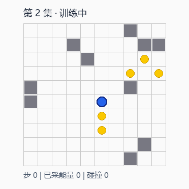
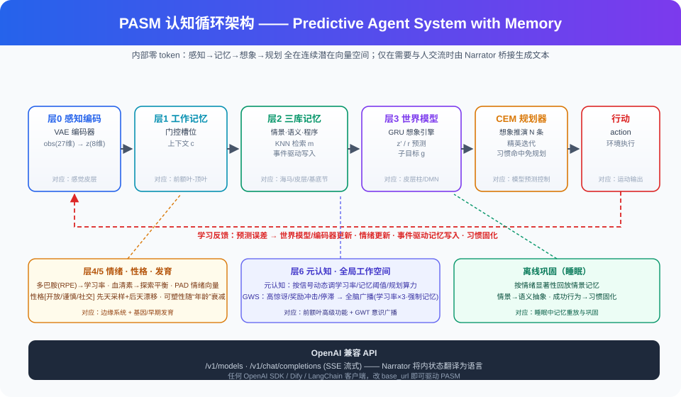

# PASM-Lite — 零 token 认知智能体 · 开源教学版

> 🚀 本仓库 = **PASM 系统介绍 + 教学最小实现**，一体化（纯 Markdown，Gitee 直接渲染）。
> 快速了解 PASM 是什么、能做什么：读根目录 [index.md](index.md)（纯文字介绍页）；
> 本 README 是完整图文版（含效果演示 GIF 与教学说明）。

---

## 一、PASM 是什么（先认识它，再看代码）

**PASM（Predictive Agent System with Memory）** 是一个"非 token 内部循环"的
仿生认知智能体框架——一个提出大胆问题的项目：

> **AI 的"思考"一定要生成 token 吗？**

今天的大模型（DeepSeek/GPT…）靠"预测下一个词"思考：内部滚动千万个 token 的概率才给出回答。
而人脑里没有 token——你骑车躲坑、伸手接杯子，全程没有一个"词语"在脑内滚动。
PASM 用工程实现这条直觉：**感知 → 工作记忆 → 情景记忆检索 → 世界模型"想象" → 规划 → 行动**，
全程连续潜在向量，零 token。

### 1.1 七层仿生认知架构（每层对应脑区与已有研究）

| 层 | 名字 | 对应脑区 | 对应已有研究 |
|---|---|---|---|
| 0 | 感知编码 | 感觉皮层 | World Models / Dreamer（VAE 潜在空间） |
| 1 | 工作记忆 | 前额叶-顶叶 | 注意力槽位记忆 |
| 2 | 情景/语义/程序记忆 | 海马体/皮层/基底节 | 情景控制、双系统理论 |
| 3 | 世界模型 | 皮层柱/DMN | MuZero / TD-MPC（"想象引擎"） |
| 4 | 情绪动机（多巴胺/血清素） | 边缘系统 | 奖励预测误差 = 多巴胺（神经科学经典结论） |
| 5 | 性格先验 + 发育可塑性 | 基因/早期发育 | Meta-RL、课程退火 |
| 6 | 元认知 + 全局工作空间 | 前额叶高级功能 | 自适应计算、GWT 理论 |

### 1.2 它带来了什么（实测证据，非 PPT）

- **会成长**：从"婴儿期"（高可塑性）发育到"成年期"，行为随经历定型——看 GIF：
  
- **性格真的分化**：同环境、同预算，只改先天性格种子——谨慎型比冒险型少撞墙 31%，
  冒险型固化习惯最多（消融/性格实验，单 seed 观察，诚实标注局限）。
- **内心可解释**：情绪向量（愉悦/唤醒/掌控）、记忆命中、习惯固化、性格漂移全部可实时查询，
  不是黑盒概率。
- **会记忆与习惯**：事件驱动写入情景记忆，反复成功的行为固化成"习惯"（免规划直出）。
- **低算力在线学习**：CPU 毫秒级单步决策，无需 GPU、无需微调重训。
- **像 DeepSeek 一样被调用**：完整引擎提供 OpenAI 兼容 API（`/v1/chat/completions` + SSE 流式），
  任何 OpenAI SDK / Dify / LangChain 改一个 base_url 即可驱动。

### 1.3 与 LLM 的分工（诚实定位）

PASM **不是**聊天大模型：知识问答/写作/编码是 DeepSeek 的主场。PASM 的主场是
**会成长的 AI 个体**——游戏 NPC、虚拟宠物、客服情绪层、陪伴养成。
二者是 System1/System2 的关系（PASM 管状态/记忆/情绪，LLM 管语言/常识），
完整引擎已实现 OpenAI 兼容 API 便于双向协作。

### 1.4 架构总览



---

## 二、PASM-Lite：本仓库是什么

**PASM-Lite 是 PASM 的开源教学版**：把上面的七层思想压缩成一个 ~260 行、单文件的
可运行最小实现，去掉情绪/性格/元认知等生产模块，只保留"零 token 认知循环"的主干，
让你 10 分钟读懂、改得动、跑得起来。

### 2.1 它实现了哪几块

- **层 0 感知**：27 维观测 → 自编码器压缩成 8 维潜在向量 `z`
- **层 1 工作记忆**：最近 4 步上下文 `c`
- **层 2 情景记忆**：KNN 检索相似经历 + "只在惊讶/奖励异常时写入"（事件驱动）
- **层 3 世界模型**：GRU 在潜在空间预测下一状态 `z′` 与奖励 `r`
- **规划**：采样 16 条动作序列在世界模型里"想象"，挑累计奖励最高的一条执行

运行输出示例：

```
世界模型预热 …
episode 0: reward -14.60 | 能量 1 | 情景记忆 1 条
episode 20: reward -12.40 | 能量 1 | 情景记忆 14 条

平均奖励(末5集): -15.50（前5集 -15.74）
```

### 2.2 快速开始

```bash
pip install torch            # CPU 即可
python pasm_lite.py
```

改一改就玩：`GridWorld(n_food=12)` 让食物更密；`Episodic(k=5)` 调检索宽度；
`Planner(n_seq=32)` 增加"想象"预算——观察行为与记忆增长的变化。

### 2.3 诚实边界（重要）

Lite 是**教学骨架，不是性能基线**：
- 演示重点是"机制跑通 + 记忆可见"，不是刷分；
- 强行为表现依赖奖励信号工程、探索策略、记忆阈值调优等细节；
- 最佳练习：对照下表，把 Lite 逐步"喂"成完整引擎，每加一块看效果变化。

| 能力 | PASM-Lite（本仓库） | 完整引擎（私有，核心仓库） |
|---|---|---|
| 零 token 认知循环 | ✅ ~260 行 | ✅ 七层实现 |
| 情绪/多巴胺-血清素调节 | — | ✅（消融显示价值 11.7 奖励差） |
| 性格先验与发育可塑性 | — | ✅（实测三性格行为分化） |
| 元认知 / 全局工作空间 | — | ✅ |
| 睡眠巩固 / 习惯固化 / 三库记忆 | — | ✅ |
| 10 万级记忆 ANN 索引 | — | ✅ |
| OpenAI 兼容 API / Docker / CLI | — | ✅ |
| 网页互动 Demo / 双性格对比 Demo | — | ✅ |
| 应用实例（游戏 NPC / 站点客服） | — | ✅ |
| **认知执行皮层**（会话状态机 + 分层记忆 + 轻量认知体，纯 Python） | — | ✅ v0.4.0（`pasm/cognitive/` + `pasm/light.py`） |
| **PASM Studio 桌面产品**（v0.15.0 认知大脑版） | — | ✅ 发行于公开仓库 pasm-qclaw |

### 2.4 纯文字介绍页（本仓库自带）

根目录 [index.md](index.md) 是纯文字版项目介绍：PASM 是什么、七层架构、
实测证据、能/不能、应用场景、部署与合作——Gitee 直接渲染 Markdown，点开即是排版好的文字页。

### 2.5 生态现状（2026-09-04 更新：PASM 已经是"大脑"了）

PASM 不止是科研引擎——2026-09-04 起三仓库同频到"认知大脑"形态：

| 仓库 | 定位 | 当前版本 |
|---|---|---|
| **PASM**（私有核心仓库） | 七层引擎 + **认知执行皮层** + 桌面全源码 + 文档 | 引擎 **v0.4.0** |
| **pasm-qclaw**（公开） | PASM Studio 桌面产品发行（Releases 安装包 + 更新通道） | 桌面 **v0.15.0** 认知大脑版 |
| **PASM-Lite**（本仓库，公开） | 零 token 认知**最小教学实现**（单文件可读可改） | 教学版（定位不变） |

"认知执行皮层"是 v0.4.0 新增的一层纯 Python 能力（`pasm/cognitive/`：会话状态机
`cog.py` + 分层记忆 `memory_layers.py`，另有 `pasm/light.py` 轻量认知体），它回答
"引擎怎么参与对话"：开口前判断意图/心情 → 产出姿态与温度 → 按话题自动召回分层记忆。
桌面产品 PASM Studio v0.15.0 正是"LLM 语言脑 + 认知皮层 + 七层/轻量引擎"的组合。
Lite 作为教学版，演示的是其中最核心的**零 token 认知循环**；认知皮层与桌面层的
完整代码在教学范围之外（详见各仓库文档）。

---

## 三、部署指南

### 3.1 关于"介绍页面"

本项目介绍采用**纯 Markdown（README.md + index.md）**，Gitee 原生渲染，
无需部署 HTML 网页即可正常阅读。若未来需要对外网页版，可随时基于内容生成
静态页再托管（Gitee Pages / CloudStudio / Vercel 等），仓库文件无需改动。

### 3.2 部署完整引擎（提供 OpenAI 兼容 API，需授权）

完整引擎（七层 + API + 应用实例）为私有项目。接入/授权合作流程：
1. 在本仓库提 issue 留言来意（演示 / POC / 定制 / NDA 看代码）；
2. 确认后获取引擎代码或演示 API；
3. 部署 = Docker 一条命令 + `PASM_API_KEY` 鉴权 + Nginx HTTPS（随授权交付部署文档）。

### 3.3 让代码被更多人跑起来

```bash
git clone https://gitee.com/arronzheng/PASM-Lite.git
cd PASM-Lite && pip install torch && python pasm_lite.py
```

---

## 四、了解更多与对接

- **开源讨论 / 提 issue**：架构方向、教学改进、零 token 认知猜想都欢迎。
- **完整引擎 / 授权 / POC / 定制**（NPC、客服情绪层、陪伴养成等）：issue 留言对接，
  确认意向后签署 NDA 查看演示与 API。
- **R0 双系统（PASM + DeepSeek）**：完整引擎对外提供 OpenAI 兼容 API，
  可与任意 LLM（DeepSeek/GPT/通义…）组合为 System1/System2——随授权提供对接文档与示例。

## License

MIT © 2026 arronZheng

*PASM-Lite 为开源教学版，与生产引擎分仓治理。欢迎 fork 学习、提 issue 讨论。*

## PASM 能做什么 / 效果 / 生态

完整能力清单、可度量效果、三仓库生态与文档地图见 **`docs/pasm_ecosystem.md`**
（会记住你并长大的伙伴、双脑对话、待办/找文件/分析文档/自动编程、
自主读书与上网自学、桌面小人形态——以及 token 省多少、记忆多快、如何成长）。
